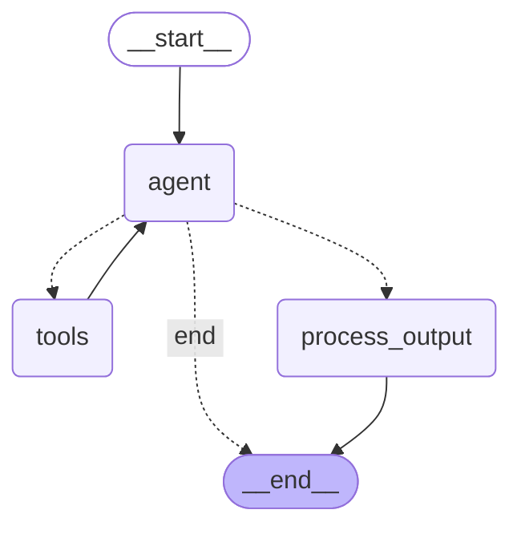

# Agent Graph Visualization

You can view this graph by opening the Markdown Preview in VS Code (Ctrl+Shift+V or Cmd+Shift+V) if you have Mermaid support, or by copying the code below to [Mermaid Live Editor](https://mermaid.live/).

