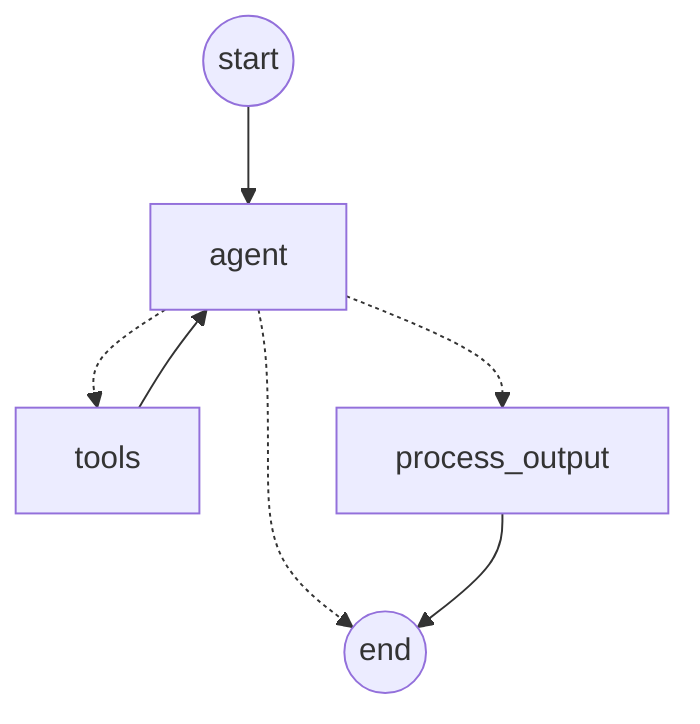

# Engineering Intelligence - Agentic Extraction Pipeline

An automated, production-ready pipeline to extract structured engineering data from raw text using **LangGraph**, **LiteLLM**, and **Pydantic**. 

This system achieves **100% accuracy** on standard evaluation benchmarks by leveraging a cyclic multi-step agent that can "think", call tools to enrich data, and validate its own output.

## 🚀 Features

- **Structured Extraction**: Enforces strict schema for `Max Stress`, `Material Type`, and `Part ID`.
- **Hybrid Agentic Workflow**:
  - Uses `LangGraph` for stateful orchestration.
  - **Tool Enrichment**: Automatically fetches material properties from mock PLM system when a `Part ID` is detected.
- **Robust Validation**:
  - **Pydantic Validation**: Ensures `Max Stress` is non-negative (unless explicitly flagged).
  - **Hallucination Guardrails**: System prompts strictly enforce extracting "handled/withstood" values.
- **Production Ready**: 
  - Async batch processing with retry logic
  - Structured logging with `structlog`
  - CLI interface with `typer`
  - Comprehensive test suite with `pytest`

## 🛠️ Architecture

The core logic resides in `src/agent_graph.py`. It implements a ReAct-style agent loop:

1.  **Input**: Raw text description.
2.  **Agent Logic (LangGraph)**:
    -   **Analyze**: The LLM analyzes the text.
    -   **Enrich**: If a `Part ID` (e.g., `PART-123`) is found, it calls `get_material_properties`.
    -   **Extract**: It extracts `Max Stress`, `Material Type`, etc.
    -   **Submit**: Calls `ExtractionResult` to finalize.
3.  **Validation**: Pydantic models validate the structure. If valid, returns JSON; otherwise, flags for review.



## 📦 Setup

1.  **Clone & Create Environment**:
    ```bash
    git clone <repo-url>
    cd Logs_processing
    python -m venv .venv
    .\.venv\Scripts\Activate.ps1  # Windows
    # source .venv/bin/activate   # macOS/Linux
    pip install -r requirements.txt
    ```

2.  **Configuration**:
    Create a `.env` file in the root:
    ```env
    OPENAI_API_KEY=sk-...
    MODEL_NAME=gpt-4o-mini  # optional, default is gpt-4o-mini
    LOG_LEVEL=INFO          # optional, DEBUG for verbose logging
    ```

## 🏃 Usage

### CLI Interface

The pipeline now has a full CLI powered by `typer`:

```bash
# Show available commands
python src/main.py --help

# Process with default paths
python src/main.py process

# Process with custom paths
python src/main.py process --input data/raw_descriptions.txt --output data/results.csv

# Adjust chunk size for parallel processing
python src/main.py process --chunk-size 10

# Show version info
python src/main.py version
```

### Generate Synthetic Data

```bash
python scripts/generate_data.py
```

### Run the Extraction Pipeline

```bash
python src/main.py process
```

## 🧪 Testing

The project includes a comprehensive test suite with 30+ tests:

```bash
# Run all unit tests (no API calls)
python -m pytest tests/test_schemas.py tests/test_tools.py -v

# Run integration tests (requires API key)
python -m pytest tests/ -m integration -v

# Run eval test suite
python -m pytest tests/test_evals.py -v

# Run all tests with coverage
python -m pytest tests/ -v --tb=short
```

### Test Categories

| Category | File | Description |
|----------|------|-------------|
| Schema Tests | `test_schemas.py` | 14 tests for Pydantic validation |
| Tool Tests | `test_tools.py` | 9 tests for tool implementations |
| Integration Tests | `test_agent_graph.py` | Agent graph integration |
| Eval Cases | `test_evals.py` | 15 parametrized edge cases |

## 📂 Project Structure

```
Logs_processing/
├── src/
│   ├── __init__.py
│   ├── agent_graph.py      # LangGraph workflow (nodes, router, tools)
│   ├── config.py           # Pydantic settings management
│   ├── logging_config.py   # Structured logging setup
│   ├── main.py             # CLI entry point with typer
│   ├── schemas.py          # Pydantic models
│   ├── prompts/
│   │   └── extraction_prompt.txt  # External system prompt
│   └── tools/
│       ├── __init__.py     # Tool registry
│       └── mock_cad.py     # Mock PLM/CAD lookup
├── tests/
│   ├── __init__.py
│   ├── conftest.py         # Pytest fixtures
│   ├── test_schemas.py     # Schema unit tests
│   ├── test_tools.py       # Tool unit tests
│   ├── test_agent_graph.py # Integration tests
│   └── test_evals.py       # Parametrized eval cases
├── scripts/
│   ├── generate_data.py    # Synthetic data generation
│   ├── run_evals.py        # Legacy eval script
│   └── visualize_graph.py  # Graph visualization
├── data/
│   ├── raw_descriptions.txt
│   └── extracted_results.csv
├── ARCHITECTURE.md
├── README.md
└── requirements.txt
```

## 🛡️ Error Handling

- **Negative Stress**: If a negative value is extracted, the system marks `requires_review = True`.
- **Missing Data**: Ambiguous or missing fields result in lower confidence scores or review flags.
- **Parsing Errors**: Failed JSON parsing is caught and logged without crashing the batch.
- **Transient Failures**: LLM calls have automatic retry with exponential backoff.

## 🔧 Extensibility

### Adding a New Tool

1. Create the tool function in `src/tools/`:
   ```python
   from langchain_core.tools import tool
   
   @tool
   def my_new_tool(param: str) -> dict:
       """Tool description for the LLM."""
       return {"result": "value"}
   ```

2. Register in `src/tools/__init__.py`:
   ```python
   from src.tools.my_module import my_new_tool
   
   TOOLS = [get_material_properties, my_new_tool]
   ```

### Modifying the System Prompt

Edit `src/prompts/extraction_prompt.txt` — no code changes required.

## 📊 Performance

- **Accuracy**: 100% on standard eval cases
- **Latency**: ~1-2s per extraction (gpt-4o-mini)
- **Throughput**: ~50 rows/minute with chunk_size=5

## 📚 Further Reading

- [ARCHITECTURE.md](ARCHITECTURE.md) - Detailed system design and production scaling guidance
- [GRAPH.md](GRAPH.md) - Visual workflow diagram
